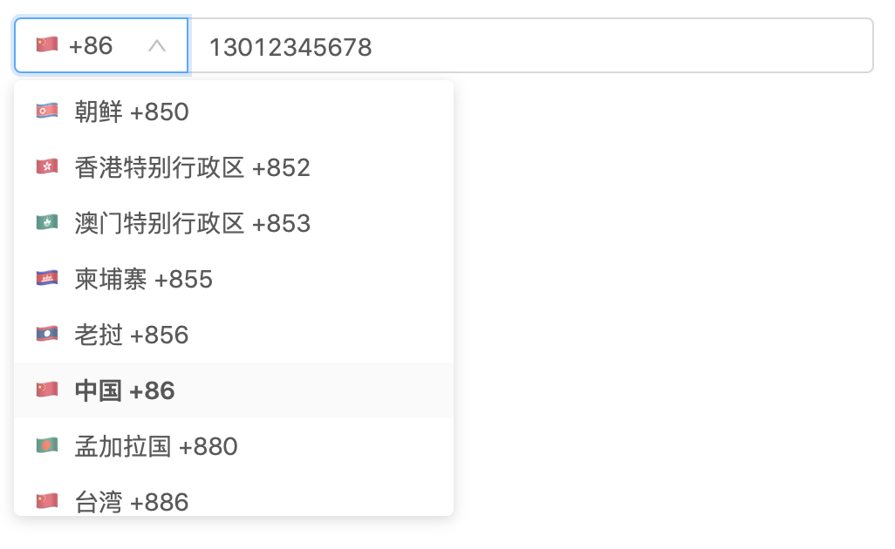

# antd-country-phone-input

Country phone input component as standard Ant.Design form item.

Currently supports 53 languages (ISO 3166-1 Alpha-2)
Default language is Chinese (zh)



## Installation

```
npm i antd-country-phone-input
```

## Usage

[](https://codesandbox.io/s/antd-country-phone-input-mtksn?fontsize=14)

```js
import React from "react";
import ReactDOM from "react-dom";
import { Form } from "antd";
import CountryPhoneCode from "antd-country-phone-input";
import "antd/dist/antd.css";

const App = ({ form }) => {
  const submit = e => {
    e.preventDefault();
    form.validateFields((err, values) => {
      if (!err) {
        console.log("Received values of form: ", values);
      }
    });
  };
  return (
    <Form onSubmit={submit}>
      <Form.Item>
        {form.getFieldDecorator("countryPhone")(<CountryPhoneCode />)}
      </Form.Item>
    </Form>
  );
};

const WrappedApp = Form.create({
  mapPropsToFields(props) {
    return {
      countryPhone: Form.createFormField({
        value: { code: 86, phone: "13012345678", short: "CN" },
        lang: en
      })
    };
  }
})(App);

const rootElement = document.getElementById("root");
ReactDOM.render(<WrappedApp />, rootElement);
```

### Supported languages (ISO 639-1)

- `ar`: Arabic
- `az`: Azerbaijani
- `be`: Belorussian
- `bg`: Bulgarian
- `bn`: Bengali
- `bs`: Bosnian
- `ca`: Catalan
- `cs`: Czech
- `da`: Danish
- `de`: German
- `en`: English
- `es`: Spanish
- `et`: Estonian
- `fa`: Persian
- `fi`: Finnish
- `fr`: French
- `gl`: Galician
- `el`: Greek
- `he`: Hebrew
- `hi`: Hindi
- `hr`: Croatian
- `hu`: Hungarian
- `hy`: Armenian
- `it`: Italian
- `id`: Indonesian
- `ja`: Japanese
- `ka`: Georgian
- `kk`: Kazakh
- `ko`: Korean
- `ky`: Kyrgyz
- `lt`: Lithuanian
- `lv`: Latvian
- `mk`: Macedonian
- `mn`: Mongolian
- `ms`: Malay
- `nb`: Norwegian Bokmål
- `nl`: Dutch
- `nn`: Norwegian Nynorsk
- `pl`: Polish
- `pt`: Portuguese
- `ro`: Romanian
- `ru`: Russian
- `sk`: Slovak
- `sl`: Slovene
- `sr`: Serbian
- `sv`: Swedish
- `th`: Thai
- `tr`: Turkish
- `uk`: Ukrainian
- `ur`: Urdu
- `uz`: Uzbek
- `zh`: Chinese
- `vi`: Vietnamese